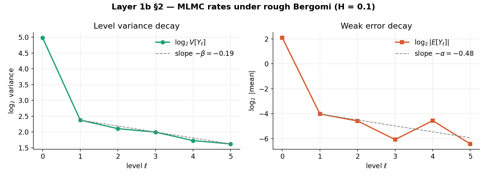

# RoughVolLab


**RoughVolLab** is an open-source Python platform for simulation, pricing, and optimal control under rough stochastic volatility. Built on the mathematical foundation that volatility is rough — that is, driven by fractional Brownian motion with Hurst exponent H ≈ 0.1 rather than standard Brownian motion — the library provides a unified, pedagogically structured codebase spanning four research layers: (1) exact and fast O(N log N) simulation of fractional Brownian motion and rough volatility models (rough Bergomi, rough Heston); (2) multilevel Monte Carlo pricing of path-dependent derivatives including Asian options, with a rigorous complexity analysis under rough dynamics; (3) non-linear market friction modelling including Almgren-Chriss market impact and rough execution slippage; and (4) a risk-aware reinforcement learning hedging engine using path signature features to handle the non-Markovian state space that rough volatility induces. No existing open-source tool covers this full stack. RoughVolLab is designed for three audiences: students encountering rough volatility for the first time, researchers needing reproducible baselines, and practitioners building production-grade rough vol implementations. The codebase is an independent research programme by a mathematics undergraduate at the University of Salford, built to publication standard and designed to grow into doctoral research — every module is individually citable, and every numerical claim is backed by a committed, reproducible run.

---

## Structure

| File | Layer | Status |
|------|-------|--------|
| `roughvol_core.py` | Shared rough-path engine (κ=0 Volterra), pinned by tests | ✅ 18 tests pass |
| `layer1_rough_vol.py` | fBm simulation, hybrid scheme, Hurst estimation | ✅ complete |
| `layer1b_mlmc_asian.py` | MLMC Asian option pricing, complexity under roughness | ✅ complete (v0.1) |
| `layer1c_roughness_audit.py` | Roughness-estimator audit (GJR + Cont–Das + MF-DFA + corruption ladder Rungs 1–5: RV-proxy mirage + envelope; microstructure noise + subsampling; jumps + bipower; finite-sample; calendar/day-of-week seasonality) | ✅ estimators + full ladder |
| `identifiability_map.py` | Layer 1c capstone — identifiability map over (η, Δ): classifier, phase diagram, per-asset η-calibration & placement (the P3 deliverable) | ✅ 15 tests pass |
| `paper_outputs.py` | Reproducibility script — one command regenerates the P3 figures (bias curves + identifiability map with asset overlay) and prints every paper number | ✅ reuses tested modules |
| `layer2_frictions.py` | Almgren-Chriss, rough slippage, Markov breakdown | 🔜 coming |
| `layer3_rl_hedging.py` | Path signatures, actor-critic, CVaR deep hedging | 🔜 coming |
| `layer4_convergence.py` | Convergence theorems, SPX calibration, diagnostics | 🔜 coming |
| `binance_data.py` · `kline_verifier.py` · `rv_series.py` | Phase B data layer: download + SHA-verify Binance klines → log-RV proxy | ✅ 66 tests pass |
| `estimate_h.py` · `interpret_h.py` | Phase B analysis: 3 estimators + de-bias vs the Rung-1 envelope | ✅ 21 tests pass |
| `equity_data.py` | Equity arm: free daily OHLC → range-based log-variance (Rung-5 gap leg) | ✅ 6 tests; run on SPX |

Project memory — layer specs, conventions, the dated decisions log, and all
measured results — lives in [`ROADMAP.md`](ROADMAP.md). Read it first.

Each layer is mapped to the undergraduate and postgraduate mathematics it
draws on, with current build status:


---

## Quick start

```bash
git clone https://github.com/Michaellumor/roughvollab.git
cd roughvollab
pip install -r requirements.txt
python layer1_rough_vol.py
```

> `pip install roughvollab` via PyPI coming once the core modules are stable.

---

## First results — Layer 1b (June 2026)

With an exact MLMC coupling (κ=0 hybrid scheme, coarse path generated from
pairwise-summed fine Brownian increments), the measured level-variance
decay rate β tracks the pathwise bound 2H across the roughness spectrum:

| H | measured β | pathwise bound 2H |
|---|---|---|
| 0.05 | 0.13 | 0.10 |
| 0.10 | 0.23 | 0.20 |
| 0.20 | 0.42 | 0.40 |
| 0.35 | 0.72 | 0.70 |

**The bound is tight** — the Asian time-average buys no extra decay,
because the Volterra strong error acts as a slowly-decaying common factor
that averaging cannot cancel. With β ≈ 2H ≪ γ = 1 this is the worst Giles
regime, and at ε = 0.025 naive MLMC costs *more* than standard Monte Carlo
(cost ratio ≈ 0.6×). That negative result is the point: it quantifies why
rough volatility needs specialised estimators, and motivates the antithetic
and conditional-MC couplings on the roadmap.



### Layer 1c — estimator audit (three estimators, a sharper finding)

Three independent roughness estimators are built on the same validated
engine and run on clean simulated paths with *known* Hurst exponent (the
Rung-0 oracle check): the Gatheral-Jaisson-Rosenbaum structure-function
estimator, the Cont-Das model-free *p*-variation estimator, and MF-DFA. All
three recover H across the roughness range — but they **disagree in the sign
of their small-H bias**. GJR and Cont-Das *over*-estimate roughness as
H → 0 (positive bias, roughly +0.06 to +0.07 at H = 0.05); MF-DFA
*under*-estimates (negative bias, about −0.02), and its bias is intrinsic
rather than finite-sample.

That the *direction* of the error depends on which estimator is used — on
perfect data, before any market microstructure noise enters — is concrete
evidence that small-H roughness measurements are estimator-dependent, which
speaks directly to the "fact or artefact?" debate.

The first corruption-ladder rung (the realized-volatility proxy) makes this
sharper still. Spot volatility is unobservable, so in practice it is
estimated from high-frequency price returns as realized variance over
windows. Feeding a **genuinely smooth** process (true H = 0.5) through that
proxy, all three estimators report **rough** H (≈ 0.05–0.16 at a 32-return
window — the empirical H ≈ 0.1 signature) — even though the underlying
volatility has no roughness at all. A control confirms the estimators read
the *true* smooth signal correctly (≈ 0.5), so the spurious roughness is
purely an artefact of the proxy construction; its severity is governed by
the sampling window (smaller windows → more spurious roughness).

A second corruption rung (microstructure noise) poisons the **price itself**
before any return is taken — modelling the bid-ask bounce as Y = X + η.
Differencing gives an MA(1) structure with negative autocorrelation, which
reads as roughness, so adding noise drags the estimate **down** toward
spurious roughness (a different mechanism from the proxy, with the same
outcome — they compound). The artefact grows with the noise-to-signal ratio
and afflicts smooth and rough paths alike; subsampling the price series
(taking every k-th tick) dilutes the tick-independent noise relative to the
persistent signal and partly recovers the estimate.

A third rung adds price **jumps** (compound Poisson) to a smooth null. A jump
is a local singularity; roughness is global; through a finite window the
estimators cannot tell them apart, so jumps too are misread as roughness and
collapse the estimate. **Bipower variation** (Barndorff-Nielsen–Shephard) —
pairing adjacent absolute returns so an isolated jump meets a clean
neighbour — partly recovers it. The fourth rung is **finite sample**: with
clean data but few observations, the estimate is biased — and here the
result is estimator-dependent. GJR and Cont–Das carry a roughly constant
upward bias and never fabricate false roughness from small samples, but
MF-DFA suffers a genuine downward finite-sample drift, reading an ultra-rough
process as even rougher. Unlike the other rungs, finite-sample bias has **no
mitigation** — financial history is finite — which bears directly on anyone
measuring H ≈ 0.1 from a few years of daily data. Together the four rungs map
how proxy estimation, microstructure noise, jumps, and finite samples each
distort measured roughness; see [`ROADMAP.md`](ROADMAP.md).

---

## Phase B — real-data pipeline & finding (complete)

A five-stage, fully-tested pipeline takes raw exchange data to a de-biased
roughness estimate: `binance_data.py` (download + SHA-256 verify) →
`kline_verifier.py` (data-quality diagnostics) → `rv_series.py` (log-RV proxy,
byte-identical to the Layer 1c Rung-1 object) → `estimate_h.py` (GJR + Cont–Das
+ MF-DFA, with trust signals and cross-estimator disagreement) → `interpret_h.py`
(de-bias an observed Ĥ against a *matched* Rung-1 bias envelope, recovering the
implied **true** H and flagging where the inversion is ill-posed). Runbook:
[`run_phaseb.md`](run_phaseb.md). 87 tests.

**Finding** (BTCUSDT + ETHUSDT, 2019–2025, 2,557 daily observations; full
write-up in [`PHASE_B_FINDINGS.md`](PHASE_B_FINDINGS.md)): the apparent
ultra-roughness of crypto volatility (GJR Ĥ ≈ 0.08) is real and
sampling-invariant, but **not identifiable** as a property of the latent
volatility. It is seen only by the estimator that *assumes* a rough model; the
model-free Cont–Das cannot resolve it and MF-DFA is unphysical; microstructure
noise is ruled out by the sampling sweep; and de-biasing is non-identified at
the vol-of-vol the data itself selects (calibrating η to the observed RV
variability forces η ≥ 1.5, exactly the regime where rough and smooth are
observationally equivalent through the proxy). An empirical demonstration, on
crypto, of the Cont–Das / Rogers position — with the model dependence calibrated
away rather than assumed.

The same wall holds across asset classes. An equity arm (`equity_data.py`,
Garman–Klass range variance on free S&P 500 daily OHLC) reads SPX as **less
rough** than crypto (GJR Ĥ ≈ 0.13 vs ≈ 0.08) — the expected direction for a
calendar/gap effect — yet de-biasing SPX is **non-identified too**. So the
roughness reading resists identification whether the calendar is continuous
(crypto) or gapped (equity). This is suggestive rather than a clean isolation
(it mixes a calendar difference with a range-vs-RV proxy difference); the clean
isolation is the simulated Rung 5 in `layer1c_roughness_audit.py`.

---

## Key references

Papers whose methods are implemented in the current code:

- Gatheral, Jaisson & Rosenbaum (2018). *Volatility is rough.* Quantitative Finance. — RFSV model and the structure-function roughness estimator (Layers 1, 1c).
- Bayer, Friz & Gatheral (2016). *Pricing under rough volatility.* Quantitative Finance. — the rough Bergomi model priced in Layer 1b.
- Bennedsen, Lunde & Pakkanen (2017). *Hybrid scheme for Brownian semistationary processes.* Finance and Stochastics. — the κ=0 hybrid scheme in `roughvol_core.py`.
- Giles (2008). *Multilevel Monte Carlo path simulation.* Operations Research. — the MLMC method underpinning Layer 1b.
- Cont & Das (2024). *Rough volatility: fact or artefact?* Sankhya B. — the normalised p-variation estimator and the "spurious roughness" critique that Layer 1c audits.

Planned layers (not yet implemented — listed to indicate direction):

- Buehler, Gonon, Teichmann & Wood (2019). *Deep hedging.* Quantitative Finance. — basis for the RL hedging engine (Layer 3).
- El Euch & Rosenbaum (2019). *The characteristic function of rough Heston models.* Mathematical Finance. — for rough Heston pricing and calibration (Layer 4).

---

## Citation

If you use RoughVolLab in your research, please cite it using the metadata
in [`CITATION.cff`](CITATION.cff). A Zenodo DOI will be minted at the first
tagged release. A BibTeX entry is provided below for convenience:

```bibtex
@software{roughvollab2026,
  author    = {Michael Lumor},
  title     = {RoughVolLab: Simulation, pricing, and optimal control
               under rough stochastic volatility},
  year      = {2026},
  url       = {https://github.com/Michaellumor/roughvollab},
  note      = {Independent research software,
               University of Salford}
}
```

---

## Licence

MIT — see [`LICENSE`](LICENSE) for full terms.
Code is free to use, modify, and distribute with attribution.
Theoretical results (proofs, theorems) accompanying published papers
remain under standard academic copyright until journal assignment.

---

*An independent research programme in applied mathematics, built to
publication standard. Results are released incrementally as modules are
completed — see [`ROADMAP.md`](ROADMAP.md) for what is measured so far.*
