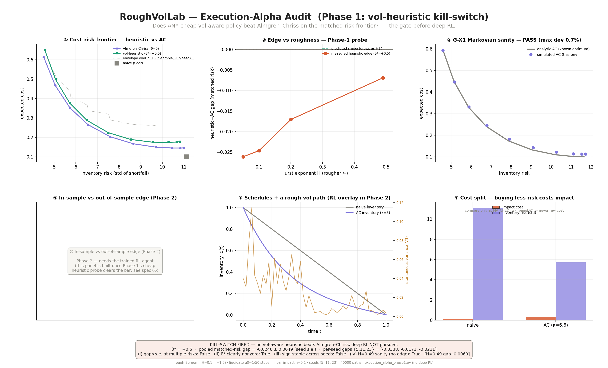

# RoughVolLab


**An open-source research programme on rough stochastic volatility — built on the principle of honest measurement over confident numbers.**

RoughVolLab interrogates the rough-volatility paradigm rather than assuming it. The paradigm holds that log-volatility behaves as a fractional process with a small Hurst exponent (H ≈ 0.1). This project asks **five questions** about that claim and reports the honest answer to each — four of which are negative, and deliberately so. It is an independent research programme by a mathematics undergraduate at the University of Salford, built to publication standard, where every numerical claim is backed by a committed, reproducible run.

> The unifying question: *is what we're seeing real, or an artefact of how we looked?*

### Five questions, five honest answers

**1. Is the roughness identifiable from data? — *Often, no.***
Roughness is measured through a noisy, discretely-sampled proxy of latent volatility. Rather than adjudicating whether measured roughness is genuine, RoughVolLab asks a prior question: *for what region of vol-of-vol and sampling parameters is the Hurst exponent identifiable at all?* Using a verified rough-Bergomi simulator, three roughness estimators (structure-function regression, a model-free *p*-variation index, and multifractal DFA) are characterised across the parameter space and formalised into an *identifiability map*. **Finding:** an identifiable region exists, but it is narrow: even multifractal DFA — the most favourable of the three estimators — recovers roughness across only ~30% of the parameter grid (concentrated at fine sampling), and the regime real assets occupy (BTC, ETH, S&P 500, whose calibration forces high vol-of-vol) falls **outside** it, where the inversion is non-identified. This reframes the "rough vs artefact" debate as a question of what the data can support. *(Layer 1c + Phase B, below.)*

**2. Can it be priced cheaply? — *Yes, but not with the fashionable tool.***
Pricing options under the rough model needs large Monte Carlo simulations, and Multilevel Monte Carlo (MLMC) is the celebrated cost-cutting technique. **Does it pay here?** **Finding:** for arithmetic-Asian options under rough Bergomi, **MLMC does not earn its place.** A conditional ("turbocharged") *standard* Monte Carlo estimator is the method of choice — and conditioning works best as single-grid standard MC, *not* bolted onto the multilevel machinery (the decisive κ-invariant ratio std-MC / conditional-MLMC = 0.41–0.45 < 1). Exact near-cell integration (κ=1) sharpens the winner further (~1.3–1.5× cheaper) without changing the convergence rate. *(Layer 1b / P2, below.)*

**3. Can the structure be traded? — *No.***
If volatility has exploitable texture, could a reinforcement-learning agent time its execution to it and beat the classical Almgren–Chriss schedule? **Finding:** **no exploitable execution edge under linear impact.** A causal vol-reactive policy, compared on the matched-risk efficient frontier, is ~5 standard errors *worse* than Almgren–Chriss, with no advantage that grows with roughness — so deep RL was not pursued. The first run produced a convincing illusion (a look-ahead artifact); it was caught by a built-in sanity gate and corrected, and the honest negative recorded. *(Layer 2 execution arc, below.)*

**4. Can the roughness be identified from an option surface? — *No (independently).***
A rough model leaves its fingerprint on the implied-volatility smile, so the roughness should in principle be recoverable by *calibration* — a second route to Question 1, on prices rather than realized variance. **Finding:** it is not. Calibrating rough-Heston (via its El Euch–Rosenbaum characteristic function) to an IV surface, a **single smile cannot identify H** (the Hurst exponent is the flat direction of the inverse problem, cond ≈ 6×10⁵); a **multi-maturity surface helps but does not cure it** (≈order-of-magnitude tightening at clean data — H-spread 106%→10% — degrading under noise); and on a **live Deribit BTC surface H is non-identifiable outright** (it rails to the boundary, |flat[H]|=0.99, with cross-run instability) — while ξ₀/ρ/ν recover plausibly and the model fits the gross smile to ~0.9 vol-points. This **confirms Question 1's answer from a second independent angle**: the option-calibration route agrees with the realized-variance route that H-roughness resists identification in the regime real markets occupy. A distinct model-level finding falls out — rough-Heston **under-produces crypto's crash-fear put tail** even at maximal roughness (motivating jumps / steeper kernels). *(Layer 4, below.)*

**5. Can roughness be hedged better than classical methods? — *No — not beyond the generic frictions effect.***
Under transaction costs, deep hedging beats delta-hedging in *any* model (a generic frictions effect, not a roughness story) — so the sharp question is whether the *rough structure* adds a hedging edge *beyond* that. RoughVolLab tests it as a contrast: the deep-vs-delta CVaR edge on a rough market (H = 0.10) vs the same edge on a smooth Markovian control (H = 0.5, identical generator, only H differs). **Finding:** deep hedging does beat delta under frictions, robustly (+1.1 CVaR, 8/8 seeds, both markets — the generic Buehler edge); but the **roughness-specific increment is modest/absent** (+0.06 ± 0.04, z = 1.4, not significant), and path-signature features add no advantage over the instantaneous Markovian state. Deep hedging works — the rough texture just isn't what makes it work. *(Layer 3 / D40.)*

### The discipline

Every claim follows the same gate-check: **state the mechanism → commit a falsifiable prediction → build/run → verify against a known answer.** Comparisons are pinned to matched accuracy / matched risk so no method wins by being sloppy, and nothing is declared "tested" without a test that names it. **Negative results are first-class outcomes** — four of the five headline findings are negative, and the value is in having earned them rather than assumed otherwise. The full prediction-and-result history lives in [`ROADMAP.md`](ROADMAP.md); the gate-check specs and recorded verdicts live in [`docs/gate_checks/`](docs/gate_checks/).

---

## Structure

| File | Layer | Status |
|------|-------|--------|
| `roughvol_core.py` | Shared rough-path engine (κ=0 Volterra), pinned by tests | ✅ 18 tests pass |
| `layer1_rough_vol.py` | fBm simulation, hybrid scheme, Hurst estimation | ✅ complete |
| `layer1b_mlmc_asian.py` | MLMC Asian pricing + complexity; opt-in antithetic / conditional / κ=1 estimator flags (P2) | ✅ complete (v0.1) + P2 |
| `layer1b_kappa1.py` | Exact near-cell (κ=1) Volterra module + coarse coupler | ✅ G-H1 / G-H2 pass |
| `layer1c_roughness_audit.py` | Roughness-estimator audit (GJR + Cont–Das + MF-DFA + corruption ladder Rungs 1–5: RV-proxy mirage + envelope; microstructure noise + subsampling; jumps + bipower; finite-sample; calendar/day-of-week seasonality) | ✅ estimators + full ladder |
| `identifiability_map.py` | Layer 1c capstone — identifiability map over (η, Δ): classifier, phase diagram, per-asset η-calibration & placement (the P3 deliverable) | ✅ 15 tests pass |
| `paper_outputs.py` | Reproducibility script — one command regenerates the P3 figures (bias curves + identifiability map with asset overlay) and prints every paper number | ✅ reuses tested modules |
| `execution_alpha.py` · `execution_alpha_phase1.py` | Execution-alpha arc (Layer 2): rough-Bergomi execution env + Almgren–Chriss + naive + causal vol-heuristic kill-switch probe | ✅ Phase 0–1 (kill-switch fired) |
| `layer2_frictions.py` | Almgren–Chriss + rough-market execution (spec: `layer2_piece1_gate_check.md`) | ✅ AC baseline built & validated in `execution_alpha.py` (G-X1, 0.7%) — dedicated `layer2_frictions.py` module not yet split out |
| `layer3_deep_hedging.py` | Layer 3 — deep-hedging engine (Buehler-style direct policy optimization, CVaR objective, self-computed signatures; isolated torch venv, deletion-safe leaf). Finds: deep beats delta under frictions, but roughness adds no hedging edge beyond it (D40) | ✅ 7 tests (isolated venv); core stays torch-free |
| `rough_heston.py` · `rough_heston_cf.py` | Layer 4 — native rough-Heston simulator (κ=0 Volterra) + characteristic-function reference & BS-IV inverter (El Euch–Rosenbaum) | ✅ 8 + 23 tests pass |
| `rough_kernel_soe.py` · `rough_heston_lifted.py` | Layer 4 — sum-of-exponentials kernel (Gate A) + multifactor Markovian-lift simulator (Gates B/C/D), O(N·n) vs O(n²) Volterra | ✅ 7 + 9 tests pass |
| `layer4_convergence.py` | Layer 4 — weak-order (α) convergence study vs the CF reference (D31, D35) | ✅ 8 tests pass |
| `layer4_smile_gate.py` | Layer 4 — OTM implied-vol smile gate (lift vs CF) | ✅ 5 tests pass |
| `layer4_calibrate.py` · `layer4_calibrate_surface.py` | Layer 4 — single-smile + multi-maturity surface calibration engines | ✅ 9 + 7 tests pass |
| `deribit_surface.py` · `calibrate_btc.py` | Layer 4 — live Deribit BTC fetch/clean + calibration driver (D39) | ✅ 8 tests pass |
| `binance_data.py` · `kline_verifier.py` · `rv_series.py` | Phase B data layer: download + SHA-verify Binance klines → log-RV proxy | ✅ 66 tests pass |
| `estimate_h.py` · `interpret_h.py` | Phase B analysis: 3 estimators + de-bias vs the Rung-1 envelope | ✅ 21 tests pass |
| `equity_data.py` | Equity arm: free daily OHLC → range-based log-variance (Rung-5 gap leg) | ✅ 6 tests; run on SPX |
| `docs/gate_checks/` | Gate-check specs + recorded verdicts (the audit index) | ✅ living |

Project memory — layer specs, conventions, the dated decisions log, and all
measured results — lives in [`ROADMAP.md`](ROADMAP.md). Read it first.

Each layer is mapped to the undergraduate and postgraduate mathematics it
draws on, with current build status:


---

## Quick start

```bash
git clone https://github.com/Michaellumor/roughvollab.git
cd roughvollab
pip install -r requirements.txt
python layer1_rough_vol.py
```

> `pip install roughvollab` via PyPI coming once the core modules are stable.

---

## First results — Layer 1b (June 2026)

With an exact MLMC coupling (κ=0 hybrid scheme, coarse path generated from
pairwise-summed fine Brownian increments), the measured level-variance
decay rate β tracks the pathwise bound 2H across the roughness spectrum:

| H | measured β | pathwise bound 2H |
|---|---|---|
| 0.05 | 0.13 | 0.10 |
| 0.10 | 0.23 | 0.20 |
| 0.20 | 0.42 | 0.40 |
| 0.35 | 0.72 | 0.70 |

**The bound is tight** — the Asian time-average buys no extra decay,
because the Volterra strong error acts as a slowly-decaying common factor
that averaging cannot cancel. With β ≈ 2H ≪ γ = 1 this is the worst Giles
regime, and at ε = 0.025 naive MLMC costs *more* than standard Monte Carlo
(cost ratio ≈ 0.6×). That negative result motivated the **P2 estimator
programme** — now concluded (decisions D20–D23). Its verdict: the antithetic
coupling is **refuted** (β unchanged, ~10% costlier at matched accuracy), while
**conditional Monte Carlo wins as single-grid "turbocharging," not multilevel**
(the κ-invariant ratio std-MC / conditional-MLMC = 0.41–0.45 < 1), with exact
near-cell integration (κ=1) sharpening it ~1.3–1.5× without changing β. The
honest headline: for rough-Bergomi Asian options, **MLMC does not earn its
place** — conditional standard MC on the κ=1 variance path is the method of
choice.


### Layer 1c — estimator audit (three estimators, a sharper finding)

Three independent roughness estimators are built on the same validated
engine and run on clean simulated paths with *known* Hurst exponent (the
Rung-0 oracle check): the Gatheral-Jaisson-Rosenbaum structure-function
estimator, the Cont-Das model-free *p*-variation estimator, and MF-DFA. All
three recover H across the roughness range — but they **disagree in the sign
of their small-H bias**. GJR and Cont-Das *over*-estimate roughness as
H → 0 (positive bias, roughly +0.06 to +0.07 at H = 0.05); MF-DFA
*under*-estimates (negative bias, about −0.02), and its bias is intrinsic
rather than finite-sample.

That the *direction* of the error depends on which estimator is used — on
perfect data, before any market microstructure noise enters — is concrete
evidence that small-H roughness measurements are estimator-dependent, which
speaks directly to the "fact or artefact?" debate.

The first corruption-ladder rung (the realized-volatility proxy) makes this
sharper still. Spot volatility is unobservable, so in practice it is
estimated from high-frequency price returns as realized variance over
windows. Feeding a **genuinely smooth** process (true H = 0.5) through that
proxy, all three estimators report **rough** H (≈ 0.05–0.16 at a 32-return
window — the empirical H ≈ 0.1 signature) — even though the underlying
volatility has no roughness at all. A control confirms the estimators read
the *true* smooth signal correctly (≈ 0.5), so the spurious roughness is
purely an artefact of the proxy construction; its severity is governed by
the sampling window (smaller windows → more spurious roughness).

A second corruption rung (microstructure noise) poisons the **price itself**
before any return is taken — modelling the bid-ask bounce as Y = X + η.
Differencing gives an MA(1) structure with negative autocorrelation, which
reads as roughness, so adding noise drags the estimate **down** toward
spurious roughness (a different mechanism from the proxy, with the same
outcome — they compound). The artefact grows with the noise-to-signal ratio
and afflicts smooth and rough paths alike; subsampling the price series
(taking every k-th tick) dilutes the tick-independent noise relative to the
persistent signal and partly recovers the estimate.

A third rung adds price **jumps** (compound Poisson) to a smooth null. A jump
is a local singularity; roughness is global; through a finite window the
estimators cannot tell them apart, so jumps too are misread as roughness and
collapse the estimate. **Bipower variation** (Barndorff-Nielsen–Shephard) —
pairing adjacent absolute returns so an isolated jump meets a clean
neighbour — partly recovers it. The fourth rung is **finite sample**: with
clean data but few observations, the estimate is biased — and here the
result is estimator-dependent. GJR and Cont–Das carry a roughly constant
upward bias and never fabricate false roughness from small samples, but
MF-DFA suffers a genuine downward finite-sample drift, reading an ultra-rough
process as even rougher. Unlike the other rungs, finite-sample bias has **no
mitigation** — financial history is finite — which bears directly on anyone
measuring H ≈ 0.1 from a few years of daily data. Together the four rungs map
how proxy estimation, microstructure noise, jumps, and finite samples each
distort measured roughness; see [`ROADMAP.md`](ROADMAP.md).

---

## Phase B — real-data pipeline & finding (complete)

A five-stage, fully-tested pipeline takes raw exchange data to a de-biased
roughness estimate: `binance_data.py` (download + SHA-256 verify) →
`kline_verifier.py` (data-quality diagnostics) → `rv_series.py` (log-RV proxy,
byte-identical to the Layer 1c Rung-1 object) → `estimate_h.py` (GJR + Cont–Das
+ MF-DFA, with trust signals and cross-estimator disagreement) → `interpret_h.py`
(de-bias an observed Ĥ against a *matched* Rung-1 bias envelope, recovering the
implied **true** H and flagging where the inversion is ill-posed). Runbook:
[`run_phaseb.md`](run_phaseb.md). 87 tests.

**Finding** (BTCUSDT + ETHUSDT, 2019–2025, 2,557 daily observations; full
write-up in [`PHASE_B_FINDINGS.md`](PHASE_B_FINDINGS.md)): the apparent
ultra-roughness of crypto volatility (GJR Ĥ ≈ 0.08) is real and
sampling-invariant, but **not identifiable** as a property of the latent
volatility. It is seen only by the estimator that *assumes* a rough model; the
model-free Cont–Das cannot resolve it and MF-DFA is unphysical; microstructure
noise is ruled out by the sampling sweep; and de-biasing is non-identified at
the vol-of-vol the data itself selects (calibrating η to the observed RV
variability forces η ≥ 1.5, exactly the regime where rough and smooth are
observationally equivalent through the proxy). An empirical demonstration, on
crypto, of the Cont–Das / Rogers position — with the model dependence calibrated
away rather than assumed.

The same wall holds across asset classes. An equity arm (`equity_data.py`,
Garman–Klass range variance on free S&P 500 daily OHLC) reads SPX as **less
rough** than crypto (GJR Ĥ ≈ 0.13 vs ≈ 0.08) — the expected direction for a
calendar/gap effect — yet de-biasing SPX is **non-identified too**. So the
roughness reading resists identification whether the calendar is continuous
(crypto) or gapped (equity). This is suggestive rather than a clean isolation
(it mixes a calendar difference with a range-vs-RV proxy difference); the clean
isolation is the simulated Rung 5 in `layer1c_roughness_audit.py`.

---

## Execution alpha — Layer 2 (Phase 0–1: the kill-switch)

Can the rough structure be *traded*? The execution arc asks whether a
reinforcement-learning agent could time its liquidation to the rough vol path
and beat the classical **Almgren–Chriss** schedule. **Phase 0**
(`execution_alpha.py`) builds the rough-Bergomi execution environment with
Almgren–Chriss and naive baselines, validated by gate **G-X1**: in the Markovian
limit the simulated AC frontier matches the closed-form optimum to **0.7%**, so
the environment can be trusted to evaluate a policy. **Phase 1**
(`execution_alpha_phase1.py`) is a cheap causal vol-reactive heuristic — the
kill-switch. On the matched-risk efficient frontier it is **~5 s.e. worse** than
Almgren–Chriss (gap −0.025, sign-stable across seeds), with no edge that grows
with roughness. **Verdict: under linear impact, rough-volatility structure
offers no executable execution edge** — so deep RL is not pursued. The probe's
first run produced a look-ahead artifact (a spurious "edge" *larger* in the
Markovian limit); it was caught by the H-sanity gate and corrected to a causal
schedule, with the precondition `E[inv_pnl] ≈ 0` proven before re-reading the
result. Spec and verdicts: [`docs/gate_checks/`](docs/gate_checks/).



---

## Layer 4 — rough-Heston: convergence, the Markovian lift, and calibration

Layer 4 is a rough-volatility **convergence-and-calibration** arc — simulation accuracy and the
inverse problem, measured honestly. No deep hedging, no RL: it builds the rough-Heston model
(El Euch–Rosenbaum) from a native O(n²) Volterra simulator and a characteristic-function reference,
then a faster **multifactor Markovian lift**, and uses both to ask whether roughness can be
*calibrated* out of an option surface (Question 4 above). The arc is decisions **D31–D39** in
[`ROADMAP.md`](ROADMAP.md).

**Convergence (D31, D35).** The weak order α of the κ=0 hybrid scheme, measured against the CF, is
**far better than the strong order** (α ≫ H) — the strong-order H-pessimism does *not* carry to
pricing, with a real penalty only at the rough end. An attempt to resolve the borderline H=0.10 weak
rate on the lift was **stopped by a known-answer gate**: the lift does **not** preserve the weak
order (a clean negative; H=0.10 left open).

**The Markovian lift (D32–D34).** A sum-of-exponentials approximation of the rough kernel
(`rough_kernel_soe.py`; the Bayer–Breneis construction selected on evidence) turns each exponential
into an OU factor, so the rough variance is reconstructed by **N Markovian factors at O(N·n) cost
instead of the O(n²) Volterra convolution** (`rough_heston_lifted.py`, source-pinned to Abi Jaber's
lift). At high vol-of-vol the lift **breaks the explicit scheme's pricing boundary** — delivering
SPX-relevant pricing to ν≈0.40, while the MLMC β-rate extends only to ν≤0.30 (a precisely-characterized
split boundary).

**Calibration — the four-questions answer (D36–D42).** An OTM-smile gate (D36) validated the lift's
high-ν smile against the CF (put-wing/ATM clean ~0.2pp; a ~1pp call-wing caveat). The calibration
engine then fits θ=[H,ν,ρ,ξ₀] in implied-vol space against the CF:

- **A single smile identifies ξ₀/ρ/ν but not H** (D37) — H is the flat direction of the inverse
  problem (cond ≈ 6×10⁵).
- **A multi-maturity surface tightens H by ~100× in conditioning** (9.0×10⁵ → 8.5×10³) **and ~10× in
  spread** (106% → 10% at clean data) **but does not cure the H~ν degeneracy** (D38).
- On a **live Deribit BTC surface** (D39, D41) — 69 cleaned points across 6 maturities (11 days → 1 year),
  calibrated against the CF — the model **fits the gross smile to ~1.1 vol-points** with **ν=0.714,
  ρ=−0.306, ξ₀=0.236 plausible** (ATM vol ≈ 48%), but **H is non-identifiable**: it rails to the lower
  bound (0.0200), |flat[H]|=0.118, with cross-run instability.
- **The non-identification is intrinsic, not a span artefact** (D41). Making the full one-year span
  computable (a per-maturity Riccati schedule keeps the CF finite at the long tenor) leaves H's
  identifiability essentially unchanged (Δ|flat[H]| = −0.001), and a per-maturity sensitivity analysis
  shows the long tenor is the **least** H-informative, not the most (sensitivity decays ~64.5 → ~5.2
  from the short to the one-year tenor). H's signal lives at the short end, where it trades off against ν.
- **The finding replicates on Ethereum** (D42): a second live surface rails H to its bound with the same
  H~ν degeneracy (corr −0.86 to −0.88 across both markets), the same short-to-long sensitivity decay, and
  the same crash-tail undershoot — establishing the non-identifiability as a cross-market structural
  feature of crypto surfaces, not a Bitcoin quirk. (A methodological by-product: cross-market calibration
  requires scale-invariant surface cleaning — an absolute vega floor tuned to BTC silently collapses the
  ETH surface.)

This is the **option-calibration confirmation of Question 1**: the realized-variance and option-surface
routes independently agree that H-roughness resists identification in the regime real markets occupy.
The arc also surfaced a distinct model limit — rough-Heston **under-produces crypto's crash-fear put
tail** even at maximal roughness, on both markets (motivating jumps / steeper kernels for future work).

Two papers seed from this arc: a **weak-order note** (α ≫ H — weak convergence faster than strong; the
lift cannot resolve the H=0.10 borderline) and a **calibration paper** — *"Identifying roughness from an
option surface: from a single smile to a live crypto market"* (the D37→D42 arc and both findings; the
option-calibration companion to the realized-variance P3).

---

## Key references

Papers whose methods are implemented in the current code:

- Gatheral, Jaisson & Rosenbaum (2018). *Volatility is rough.* Quantitative Finance. — RFSV model and the structure-function roughness estimator (Layers 1, 1c).
- Bayer, Friz & Gatheral (2016). *Pricing under rough volatility.* Quantitative Finance. — the rough Bergomi model priced in Layer 1b.
- Bennedsen, Lunde & Pakkanen (2017). *Hybrid scheme for Brownian semistationary processes.* Finance and Stochastics. — the κ=0 hybrid scheme in `roughvol_core.py`.
- Giles (2008). *Multilevel Monte Carlo path simulation.* Operations Research. — the MLMC method underpinning Layer 1b.
- Almgren & Chriss (2001). *Optimal execution of portfolio transactions.* Journal of Risk. — the optimal-liquidation baseline in the Layer-2 execution arc.
- Cont & Das (2024). *Rough volatility: fact or artefact?* Sankhya B. — the normalised p-variation estimator and the "spurious roughness" critique that Layer 1c audits.
- El Euch & Rosenbaum (2019). *The characteristic function of rough Heston models.* Mathematical Finance. — the rough-Heston CF reference (`rough_heston_cf.py`) and the calibration target audited in Layer 4.
- Abi Jaber (2019). *Lifting the Heston model.* Quantitative Finance. — the multifactor Markovian lift (`rough_heston_lifted.py`), O(N·n) vs the O(n²) Volterra convolution.
- Buehler, Gonon, Teichmann & Wood (2019). *Deep hedging.* Quantitative Finance. — the deep-hedging objective (CVaR direct policy optimization) in the Layer-3 engine (`layer3_deep_hedging.py`), distinct from the Layer-2 execution arc.

---

## Citation

If you use RoughVolLab in your research, please cite it using the metadata
in [`CITATION.cff`](CITATION.cff). A Zenodo DOI will be minted at the first
tagged release. A BibTeX entry is provided below for convenience:

```bibtex
@software{roughvollab2026,
  author    = {Michael Lumor},
  title     = {RoughVolLab: Simulation, pricing, and optimal control
               under rough stochastic volatility},
  year      = {2026},
  url       = {https://github.com/Michaellumor/roughvollab},
  note      = {Independent research software,
               University of Salford}
}
```

---

## Licence

MIT — see [`LICENSE`](LICENSE) for full terms.
Code is free to use, modify, and distribute with attribution.
Theoretical results (proofs, theorems) accompanying published papers
remain under standard academic copyright until journal assignment.

---

*An independent research programme in applied mathematics, built to
publication standard. Results are released incrementally as modules are
completed — see [`ROADMAP.md`](ROADMAP.md) for what is measured so far.*
